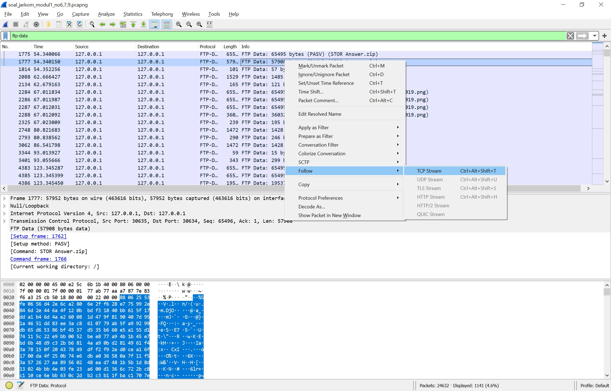

# Laporan Resmi Praktikum Komunikasi Data dan Jaringan Komputer Modul 1  Kelompok T14

## Anggota Kelompok:

1. Hisyam Zulkarnain F – 05311840000019
2. Muhamad Rifaldi - 05311840000022
  
## A. Display Filter  

### Soal No. 1  

Sebutkan webserver yang digunakan ketika mengakses "testing.mekanis.me"!  

### Penyelesaian

1. Gunakan wireshark display filter expression    
  
```
http.host == testing.mekanis.me
```  


2. Klik kanan pada salah satu paket >> Follow >> TCP Stream


### Soal No. 2

Simpan gambar "Tim_Kunjungan_Kerja_BAKN_DPR_RI_ke_Sukabumi141436.jpg"!

### Penyelesaian

1. Gunakan wireshark display filter expression

```
HTTP
```


2. Pilih menu file >> Export Object >> http


3. Cari file gambar "Tim_Kunjungan_Kerja_BAKN_DPR_RI_ke_Sukabumi141436.jpg", kemudian Save.


4. Buka file gambar, maka akan tampil sebagai berikut


### Soal No. 3

Cari username dan password ketika login di "ppid.dpr.go.id"!

### Penyelesaian

1. Gunakan wireshark display filter expression dibawah, kemudian klik kanan pada paket yang tertera >> follow >> TCP Stream

```
http.request.method == POST
```


### Soal No. 4

Temukan paket dari web-web yang menggunakan basic authentication method!

### Penyelesaian

1. Gunakan wireshark display filter expression

```
http.authbasic
```


### Soal No. 5

Ikuti perintah di aku.pengen.pw! Username dan password bisa didapatkan dari file .pcapng!

### Penyelesaian

1. Gunakan wireshark display filter expression dibawah, kemudian cek credential pada paket nomor 31651. Maka didapat username dan password sebagai berikut

```
http.host=="aku.pengen.pw”
```


2. Masuk ke website aku.pengen.pw menggunakan username dan password tadi, kemudian jawab soal yang tertera.


### Soal No. 6

Seseorang menyimpan file zip melalui FTP dengan nama "Answer.zip". Simpan dan Buka file "Open This.pdf" di Answer.zip. Untuk mendapatkan password zipnya, temukan dalam file zipkey.txt (passwordnya adalah isi dari file txt tersebut).

### Penyelesaian

1. Gunakan wireshark display filter expreession dibawah, kemudian follow TCP Streams pada paket dengan info "Answer.zip"

```
ftp-data
```



2. Ubah show and save data as menjadi "Raw", kemudian Save dengan nama Answer.zip


3. Lalu follow TCP Stream pada paket dengan info "zipkey.txt", maka akan muncul password sebagai berikut


4. Unzip file "Answer.zip" menggunakan password tersebut, kemudian Buka file "Open This.pdf". Maka akan tampil sebagai berikut


### Soal No. 7

Ada 500 file zip yang disimpan ke FTP Server dengan nama 1.zip, 2.zip, ..., 500.zip. Salah satunya berisi pdf yang berisi puisi. Simpan dan Buka file pdf tersebut.
Your Super Mega Ultra Rare Hint = nama pdf-nya "Yes.pdf".

### Penyelesaian

1. Gunakan wireshark display filter expression dibawah, kemudian follow TCP Sream

```
ftp-data contains "Yes.pdf"
```


2. Ubah show and save data as menjadi "Raw", kemudian Save dengan extensi .zip


3. Unzip file zip tersebut, kemudian buka file "Yes.pdf" didalamnya. Maka akan tampil sebagai berikut


### Soal No. 8

Cari objek apa saja yang didownload (RETR) dari koneksi FTP dengan Microsoft FTP Service!

### Penyelesaian

1. Gunakan wireshark display filter expression dibawah, Maka akan mendapatkan paket dari koneksi FTP dengan Microsoft FTP Service

```
ftp contains "Microsoft"
```


### Soal No. 9

Cari username dan password ketika login FTP pada localhost!

#### Penyelesaian

1. Gunakan wireshark display filter expression `ftp`, kemudian filter menggunakan regular expression : `User`


2. Kemudian follow TCP stream, didapatlah username dan password nya sebagai berikut


### Soal No. 10

Cari file .pdf di wireshark lalu download dan buka file tersebut!
clue: "25 50 44 46"

### Penyelesaian

1. Gunakan wireshark display filter expression dibawah, cek link yang terdapat pada paket yang tertera. Double click untuk mengunduh file pdf tersebut.

```
http contains ".pdf"
```


2. Maka didapat file pdf dengan nama "1759.pdf" dengan isi tampilan berikut


## Capture Filter

### Soal No. 11

Filter sehingga wireshark hanya mengambil paket yang mengandung port 21!

### Penyelesaian

1. Gunakan wireshark Capture Filter expression 

```
port 21
```


### Soal No. 12

Filter sehingga wireshark hanya mengambil paket yang berasal dari port 80!

### Penyelesaian

1. Gunakan wireshark Capture Filter expression 

```
src port 21
```


### Soal No. 13

Filter sehingga wireshark hanya mengambil paket yang menuju  port 443!

### Penyelesaian

1. Gunakan wireshark Capture Filter expression 

```
dst port 443
```


### Soal No. 14

Filter sehingga wireshark hanya mengambil paket yang berasal dari ip kalian!

### Penyelesaian

1. Cari IP address menggunakan perintah "ipconfig" pada cmd, kemudian capture menggunakan wireshark capture filter expression 

```
src [ip address]
```

```
src 192.168.100.2
```


### Soal No. 15

Filter sehingga wireshark hanya mengambil paket yang tujuannya ke monta.if.its.ac.id!

### Penyelesaian

1. Gunakan wireshark Capture filter expression dibawah, kemudian test dengan membuka laman monta.if.its.ac.id

```
dst monta.if.its.ac.id
```


